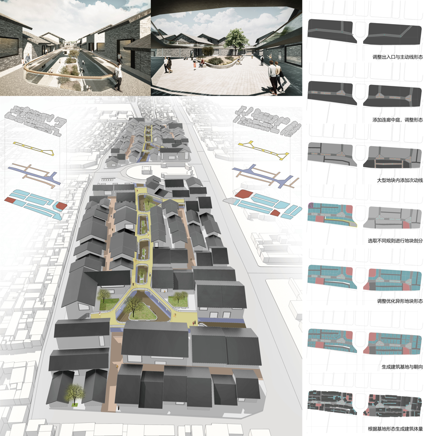

# commercial street generator
a rule-based historical commercial street generator

This research is from the 2020 graduated student's architectural design studio of [Inst. AAA](https://github.com/Inst-AAA).

### Related Papers
[张柏洲,李飚.几何原型与形态编码在商业建筑平面生成中的应用探索](https://archialgo-com-sources.oss-cn-hangzhou.aliyuncs.com/pdf/pdf-strategies-commercial.pdf "PDF")
